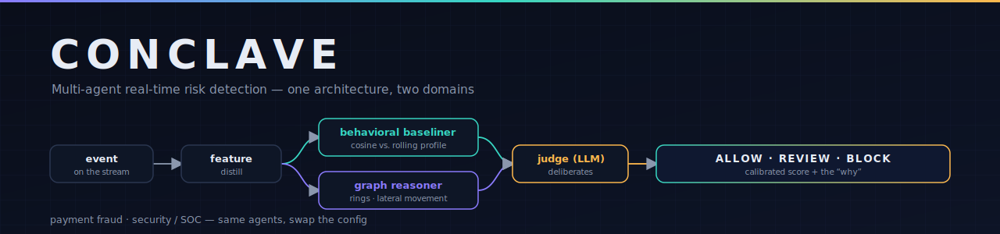
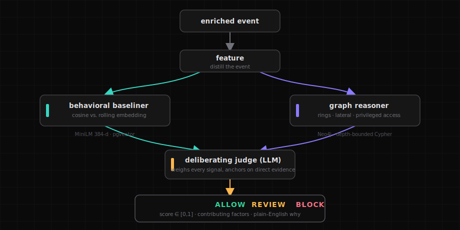
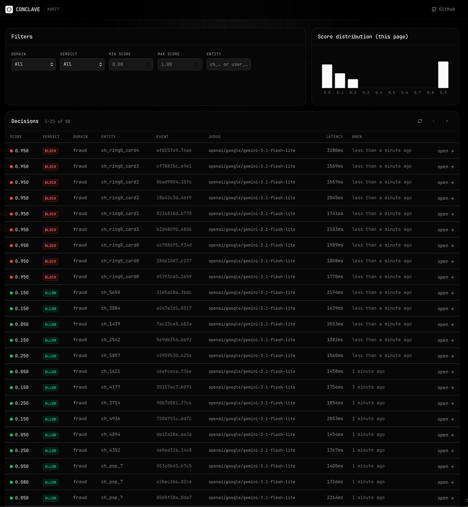
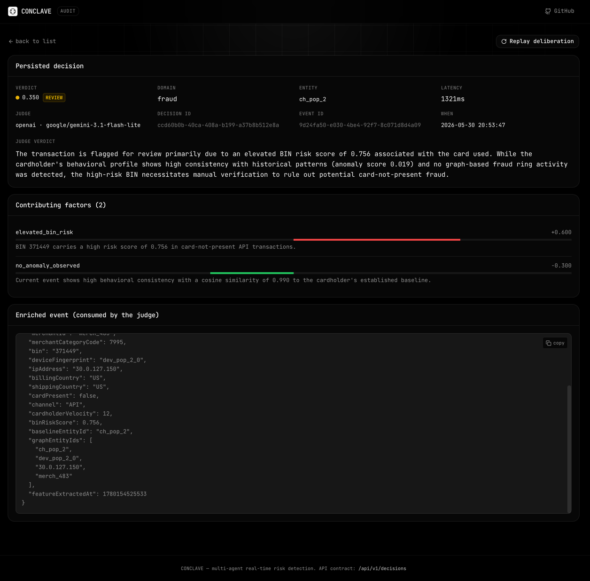
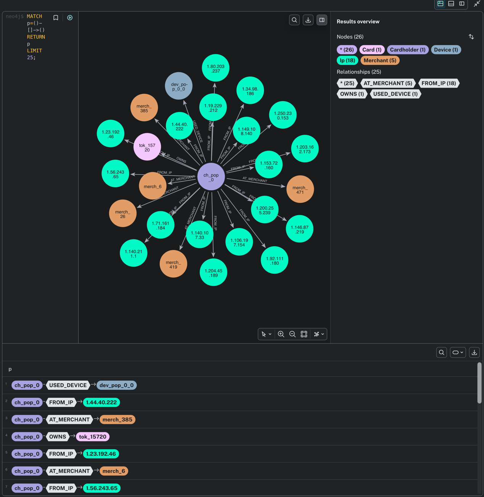
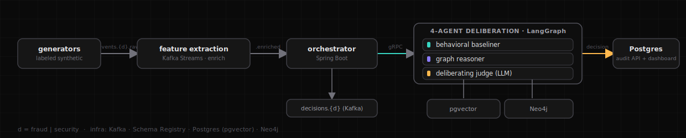

<p align="center">
  
</p>

<h1 align="center">CONCLAVE</h1>

<p align="center">
  <b>Real-time risk decisions that are accurate, relational, and explainable.</b><br>
  Four specialized agents deliberate over every event and return a calibrated verdict — with the reasoning attached.
</p>

<p align="center">
  <a href="https://conclave-website.pages.dev"><b>Live site</b></a> &nbsp;·&nbsp;
  <a href="paper/conclave.pdf"><b>Paper</b></a> &nbsp;·&nbsp;
  <a href="#quickstart"><b>Quickstart</b></a> &nbsp;·&nbsp;
  <a href="#how-it-works"><b>How it works</b></a> &nbsp;·&nbsp;
  <a href="#architecture"><b>Architecture</b></a> &nbsp;·&nbsp;
  <a href="#one-architecture-two-domains"><b>Domains</b></a>
</p>

---

A single event is only suspicious in **context**, and a score nobody can explain is a score
nobody can act on. Three questions decide every event — and most systems answer one well and
bolt the rest on:

```
                         a new event hits the wire
                                   │
                  ┌────────────────┼────────────────┐
                  ▼                ▼                ▼
        ┌───────────────┐ ┌───────────────┐ ┌───────────────┐
        │ is this NORMAL│ │ is it part of │ │ can you EXPLAIN│
        │ for THIS      │ │ a bad PATTERN?│ │ it to an      │
        │ entity?       │ │ ring · lateral│ │ analyst — now?│
        └───────┬───────┘ └───────┬───────┘ └───────┬───────┘
            behavioral        relational        calibrated +
             anomaly          structure         explainable
```

CONCLAVE answers **all three, together, per event** — then hands back a verdict and the *why*.

<p align="center">
  
</p>

Every decision is persisted with its verdict, calibrated score, ranked contributing factors,
and a Markdown rationale. If any agent — or the LLM itself — is down, the judge **falls back**
to a deterministic verdict from the same signals; the pipeline never returns "no decision."

---

## Benchmarks

End-to-end through the running stack, judged by `gemini-3.1-flash-lite` (OpenRouter), joined
against leakage-proof ground-truth labels. Full method and tables in the
**[paper](paper/conclave.pdf)**.

```
  DOMAIN          DECISIONS   ROC-AUC   BLOCK PRECISION    ATTACKS FLAGGED
  ────────────    ─────────   ───────   ───────────────    ───────────────
  Payment fraud      332       0.999    100%  (0 FP)        100%
  Security / SOC     254       0.819    100%  (0 FP)        lateral movement
```

Fraud: zero false-positive blocks, every injected attack flagged at review-or-higher, 98.9%
precision at FPR ≤ 1%. The paper's honest finding — *detection tracks evidence coverage*: where
an agent surfaces the discriminative signal, detection is near-perfect; where none does
(security exfiltration / ATO), the judge has nothing to act on. Latency is LLM-bound — the
deterministic agents cost p99 0.74 ms (baseline) and 6 ms (graph).

---

## See it running

<p>
  
  <br><sub><b>Live decision feed (fraud)</b> — ALLOW / REVIEW / BLOCK together as a card-testing ring trips the graph reasoner.</sub>
</p>

<p>
  
  <br><sub><b>One decision, expanded</b> — calibrated score + verdict, ranked factors, the judge's rationale, and the exact enriched event it saw.</sub>
</p>

<p>
  
  <br><sub><b>The relational layer (Neo4j)</b> — one device fanning out across many cards: the ring the graph reasoner surfaces.</sub>
</p>

---

## Quickstart

> Prereqs: Docker Desktop · JDK 25 · Maven 3.9+ · uv · Node 20+

```bash
git clone https://github.com/Abhishek-Aditya-bs/Conclave && cd Conclave
cp .env.example .env          # add your key (OpenRouter is cheapest)

./scripts/up.sh               # pick judge model + domain, then builds, boots, opens the dashboard
./scripts/seed.sh             # fire a labeled, multi-day synthetic burst (prompts the domain)
open http://localhost:5173    # live decision explorer

./scripts/down.sh             # tear it all down (containers, volumes, dashboard)
```

The default judge is `google/gemini-3.1-flash-lite` via OpenRouter — fast and cheap. Pass
positional args to skip every prompt (handy for CI):

```bash
./scripts/up.sh serving fraud  && ./scripts/seed.sh fraud      # cloud judge, fraud
./scripts/up.sh local   security && ./scripts/seed.sh security # host Ollama, security
```

Two knobs: **LLM mode** (`serving` cloud key, default · `local` host Ollama, no key) and
**domain** (`fraud` · `security`). API keys live only in the git-ignored `.env`.

---

## How it works

The judge never sees raw data — it sees **distilled, structured evidence** from three
independent agents, then deliberates.

**Behavioral baseliner** — every entity carries a rolling fingerprint: an EMA of its past event
embeddings (MiniLM, 384-d, in Postgres + `pgvector`). A new event is scored by cosine similarity
to that fingerprint.

```
  entity profile ●━━━━━━━━━━━►              (EMA of past behavior)
                  ╲  θ
   new event  ●━━━━╲━━►   small θ → in character   → low  anomaly
   new event  ●━━►  ╲     large θ → out of character → high anomaly
```

A count-aware warmup keeps brand-new entities from being judged on a single event, and scoring
is **read-only** — a suspicious event never poisons the profile it is measured against.

**Graph reasoner** — entities live in Neo4j. Depth-bounded Cypher templates surface structure a
single event can't show: a device fanning across many cards (ring), one identity hopping hosts
(lateral movement), access to sensitive resources.

**Deliberating judge** — an LLM weighs the feature digest, the behavioral signal, and the graph
signal, then emits a calibrated `score`, a `verdict`, ranked `contributing_factors`, and a short
explanation — anchored on the strongest direct evidence, never on the easily-fooled embedding.

---

## Architecture

<p align="center">
  
</p>

| Service | Role | Stack |
|---|---|---|
| **orchestrator** | ingest, enrichment, feature extraction, persistence, audit API | Java · Spring Boot · Kafka Streams |
| **baseline** | rolling behavioral embeddings + cosine scoring | Java · Postgres + pgvector · MiniLM |
| **graph** | relational pattern templates | Java · Neo4j |
| **agents** | the LangGraph deliberation + LLM judge | Python · LangGraph · gRPC |
| **dashboard** | live decision explorer | React · Vite |

Java holds the data plane (stream processing, state, the decision write path, the audit API);
Python holds the control plane (the agent graph + judge). They talk over gRPC.

---

## One architecture, two domains

The *same* agents and pipeline serve very different problems — you only swap the configuration.
Domain-specific code lives **only** in the feature extractors and the graph schemas.

|  | Payment fraud | Security / SOC |
|---|---|---|
| **Event** | card-not-present payment | auth / resource-access |
| **Entity** | cardholder / card | principal / identity |
| **Graph** | cardholder · device · IP · merchant | principal · host · resource |
| **Patterns** | card-testing ring · bust-out · ATO | lateral movement · exfiltration · ATO |

What's shared verbatim: the deliberation graph, the evidence schema, the EMA baseliner, the
calibration band, the judge, the decision schema, the audit API, and the degradation path.

---

## Project layout

```
conclave/
├── orchestrator/   ingest · Kafka Streams enrichment · audit API   (Java)
├── baseline/       rolling embeddings + cosine scoring             (Java · pgvector)
├── graph/          relational pattern templates                    (Java · Neo4j)
├── agents/         LangGraph deliberation + LLM judge              (Python)
├── generators/     synthetic multi-day, multi-distribution data    (Java)
├── dashboard/      live decision explorer                          (React)
├── website/        marketing site                                  (React)
├── paper/          arXiv paper (LaTeX) + benchmark numbers
├── benchmark/      capture harness (decisions ⋈ ground-truth)
├── scripts/        up · down · seed · dashboard · logs · test
└── docker-compose.yml
```

---

## Configuration

Everything is environment-driven (see [`.env.example`](.env.example)):

| Variable | Purpose | Default |
|---|---|---|
| `JUDGE_LLM_PROVIDER` | judge backend: `openai` (OpenAI / OpenRouter) · `anthropic` · `ollama` | `anthropic` |
| `JUDGE_LLM_MODEL` | model id (per-provider default if blank) | — |
| `OPENAI_API_KEY` / `ANTHROPIC_API_KEY` | serving-mode credentials (`.env` only) | — |
| `OPENAI_BASE_URL` | OpenAI-compatible endpoint | `https://api.openai.com/v1` |
| `OLLAMA_BASE_URL` | local-mode (host Ollama) endpoint | `http://host.docker.internal:11434` |
| `conclave.baseline.ema-decay` | behavioral memory (≈ `1/(1−decay)` events) | `0.85` |

---

## Develop and test

```bash
./scripts/test.sh          # full suite (resolves JDK 25 for you)
./scripts/test.sh java     # Java services only (mvn verify)
cd agents && uv run pytest # Python deliberation only
```

---

<p align="center">
  <sub>Built to show that risk detection can be accurate, relational, <b>and</b> explainable — at once.</sub>
</p>
